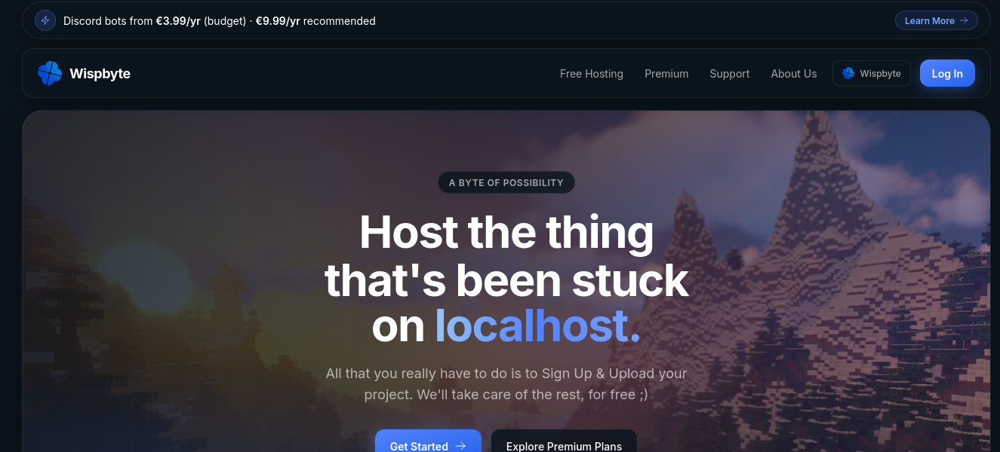
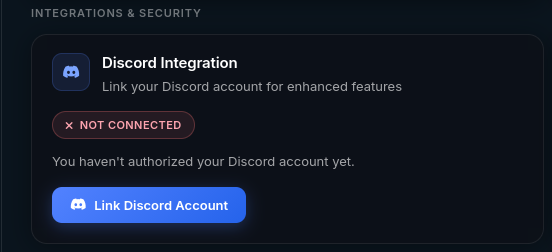

## Click me and I get access to your servers
*Fixed on: 13/07/2026*

[Website](https://wispbyte.com) | [Discord](https://www.wispbyte.com/discord)

WispByte is a hosting platform mainly designed for Discord bots, but it also supports hosting other things like Minecraft servers. It has free and paid services.



There's an option to link your Discord to your Wispbyte account:



When you hit the button, this will issue a request to `/client/api/auth/discord`, which redirects you to this link:

```bash
https://discord.com/api/oauth2/authorize?response_type=code&redirect_uri=https%3A%2F%2Fwispbyte.com%2Fclient%2Fapi%2Fauth%2Fdiscord%2Fcallback&scope=identify%20email%20guilds
```

If you saw the [guns.lol](guns.lol.md) case or have knowledge, you already know what's wrong here. There's no `state`, which means that I can directly request the Discord API and redirect users to my callback link, which will make them link my Discord account to their Wispbyte account. Total account takeover.

> Would like to show the video PoC, but it has my private email address xd. Anyways, by watching the one in guns.lol, you can imagine how it was.

This one has a downside, and is that if the user is not logged in on the target, the backend will instead log-in the user using your Discord as identification (they will get access to an account with your identity)

The dev took a while to read my messages, but once he readed them, it fixed the issue quickly.