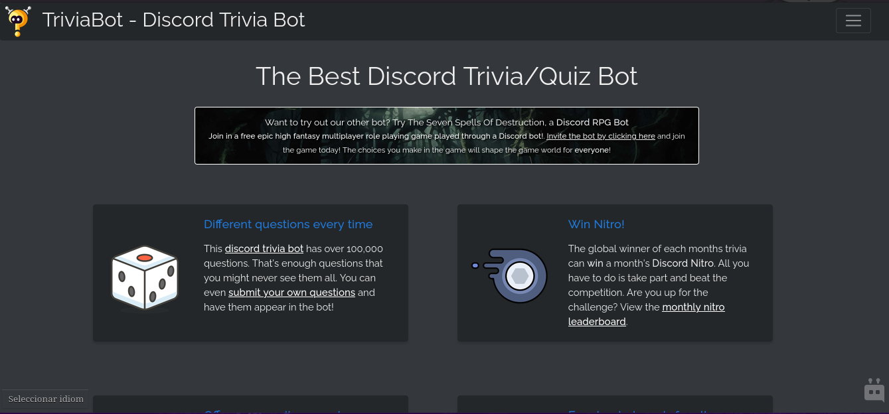

## std::quote has a good opsec
*Fixed on: 04/08/2026*

> Of all vulnerabilities on this repo, this is part of the most interesting ones.

[Website](https://triviabot.co.uk) | [Discord](https://discord.gg/brainbox)

This is a bot mainly used for quiz games. It has a wide set of questions for them and it even hosts global events, on which the winner usually wins a Discord Nitro. The bot itself is [open source](https://github.com/brainboxdotcc/triviabot/).



While reading the source code, I noticed that the bot commands are implemented as a native module (ELF thingy). But there were some special commands that aren't part of the module:

```cpp
void TriviaModule::DoExternalCommands(std::vector<dpp::slashcommand>& normal, std::vector<dpp::slashcommand>& admin) {
	/* This adds commands to the slash command system that are external to the bot's executable */
	std::string path(getenv("HOME"));
	path += "/www/api/commands/commands.json";
	json commandlist;
	std::ifstream slashfile(path);
	slashfile >> commandlist;
    // ... [snip]
}
```

As the `www` indicated web, I tought that those commands could be listed in the main website... and I was right:

```bash
❯ curl -v "https://triviabot.co.uk/api/commands/commands.json"  
# ... [snip]
> GET /api/commands/commands.json HTTP/2
> Host: triviabot.co.uk
> User-Agent: curl/8.21.0
> Accept: */*
> 
* Request completely sent off
* TLSv1.3 (IN), TLS handshake, Newsession Ticket (4):
* TLSv1.3 (IN), TLS handshake, Newsession Ticket (4):
< HTTP/2 200 
< date: Tue, 04 Aug 2026 22:17:28 GMT
< content-type: application/json
< content-length: 702
# ... [snip]
[
{"name":"serverinfo", "description": "Show info on a server", "admin":true, "params":[{"type":"string", "name":"id", "description": "User or Guild ID", "required":true}]},
{"name":"localrank", "description": "Show your local rank card", "admin":false, "params":[{"type":"user", "name":"user", "description": "User to look up", "required":false}]},
{"name":"permcheck", "description": "Check permissions of a guild", "admin":true, "params":[{"type":"string", "name":"guild", "description": "Guild ID", "required":true}]},
{"name":"globalrank", "description": "Show your global rank card", "admin":false, "params":[{"type":"user", "name":"user", "description": "User to look up", "required":false}]}
]
```

These four commands are actually PHP files, and this is how the bot was running them:

```cpp
void runcli(guild_settings_t settings, const std::string &command, uint64_t guild_id, uint64_t user_id, uint64_t channel_id, const std::string &parameters, const std::string& interaction_token, dpp::snowflake command_id)
{
	std::string home(getenv("HOME"));

	/* IMPORTANT: dpp::utility::exec makes parameters safe */
	dpp::utility::exec("/usr/bin/php", { fmt::format("{}/www/cli-run.php", home), command, std::to_string(guild_id), std::to_string(user_id), std::to_string(channel_id), parameters }, [channel_id, guild_id, interaction_token, command_id](const std::string &output) {
		guild_settings_t s = module->GetGuildSettings(guild_id);
		/* Output response as embed */
		std::string reply = trim(output);
		if (!reply.empty()) {
			module->ProcessEmbed(interaction_token, command_id, s, reply, channel_id);
		} else if (!interaction_token.empty()) {
			/* Empty reply but handled. delete "thinking" notification */
			bot->core->post_rest(API_PATH "/webhooks", std::to_string(bot->core->me.id), dpp::utility::url_encode(interaction_token) + "/messages/@original", dpp::m_delete, "", [&](auto& json, auto& request) {}, "", "");
		}
	});
}
```

I jumped then to the `utility::exec` function of the `D++` Discord API wrapper and... it was doing only this with the command:

```cpp
void exec(const std::string& cmd, std::vector<std::string> parameters, cmd_result_t callback) {
	auto t = std::thread([cmd, parameters, callback]() {
        // ... [snip]
        std::vector<std::string> my_parameters = parameters;
        std::string result;
        std::stringstream cmd_and_parameters;
        cmd_and_parameters << cmd;
        for (auto &parameter: my_parameters) {
            cmd_and_parameters << " " << std::quoted(parameter);
        }
        /* Capture stderr */
        cmd_and_parameters << " 2>&1";
        std::unique_ptr<FILE, int(*)(FILE*)> pipe(popen(cmd_and_parameters.str().c_str(), "r"), pclose);
        if (!pipe) {
            return;
        }
        // ... [snip]
    }
}
```

The `popen` standard C function just runs this:

```bash
/bin/sh -c "&command"
```

As this was escaping arguments with the `quoted` C++ function, every double quote was being escaped, just as this:

```bash
/bin/sh -c "&command" "argument\";owo"
```

The catastrophic flaw here is that, double quoted strings in shells also allows *substitutions*. Bash for example, allows you to put expressions like `$(<command>)` or 

```bash
`command`
```

Which will get substituted by the actual command output in the resulting string:

```bash
❯ echo "hey $(id), you can suck my cock"
hey uid=1000(vzon) gid=1000(vzon) groups=1000(vzon), you can suck my cock
```

On the function that TriviaBot executes, user provided arguments after the base command are passed to the D++ exec function. Indeed what that means, is that I can blindly execute system commands as the bot process user by running one of the two allowed user commands that aren't native:

https://github.com/user-attachments/assets/dc9d8fd4-f224-4eb3-bd4a-4d3b68f830ee

Obviously, with this you can steal the bot token and every other credentials that were in there (and maybe fully compromise the server).

The dev fixed it real quick. He also [improved the escaping](https://github.com/brainboxdotcc/DPP/pull/1632) of the D++ involved function (yes, he is one of the maintainers of the library).