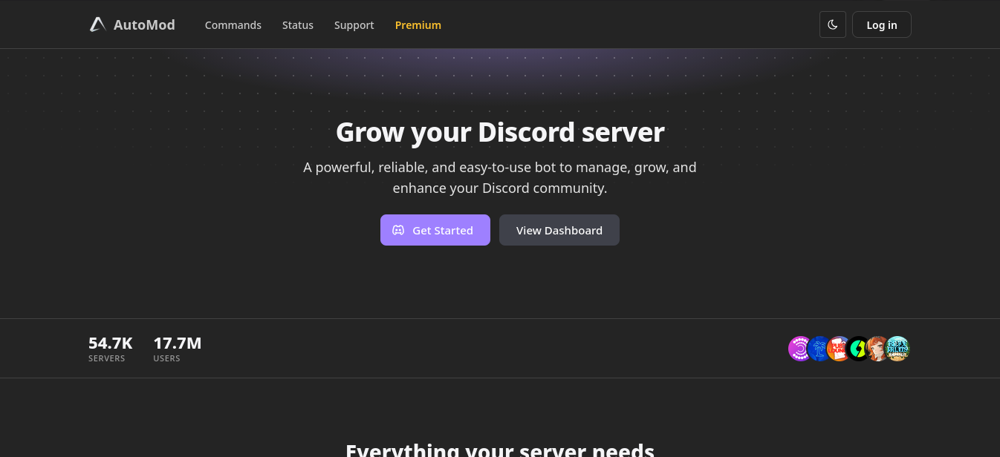
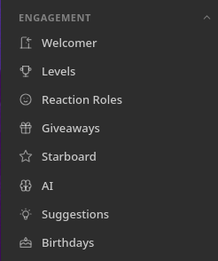

## The backdoor
*Fixed on: 27/07/2026*

[Website](https://www.automod.xyz) | [Discord](https://www.automod.xyz/server)

This bot is more focused on moderation stuff as his name may indicate, but on overall, is just another all-in-one Discord bot.



> I discovered this bug before the dashboard was recoded into what you may see now. The listed endpoints does not exist anymore

The bot has an engagement section, which has modules for creating reaction roles and giveaways.



When you create a reaction role, this was sent via `POST` to `/api/v1/mongo/roles?guildId=<Snowflake>&reactionRoleId=<UUID>`:

```jsonc
{
    "emojis":"Array<String>",
    "buttons":"Array<ActionRow<Button>>",
    "data":{
        "id":"<UUID>",
        "guild":"<Snowflake>",
        "mode":"Enum"
        // ... [snip]
    }
}
```

And this via `POST` to `/api/v1/mongo/giveaways?guildId=<Snowflake>&giveawayId=<UUID>&tz=<Timezone>`

```jsonc
{
    "data":{
        "id":"<String>",
        "price":"<String>",
        "winners":"<Integer>",
        "channel":"<Snowflake>",
        "guild":"<Snowflake>"
        // ... [snip]
    },
    "previousDate":null,
    "entries":0
}
```

Welp, the backend for some reason was assigning every present field to the created reaction role and giveaway objects, including the `guild` attribute. As there wasn't also verification of the `channel` attribute, that means I can, on other servers:

- Create giveaways 
- Create reaction roles 

With the giveaways thing I can send messages to the channels of the target guild, and as it was working as expected, I can also put as reward a role from the guild and when it ends, it will give the role to the winner.

With the reaction roles, I wasn't able to send messages nor create reactions but, if I point to a message in the guild and I react to it with the given emoji... it will give me the role.

https://github.com/user-attachments/assets/6aaa05a1-00dd-4815-9690-8cf1a461de5b

The last one literally seems like putting a backdoor: there's nothing, but if you react with the specified emoji(s), the bot will happily give you the role(s) that you entered in the reaction role.

The dev fixed it quickly.


