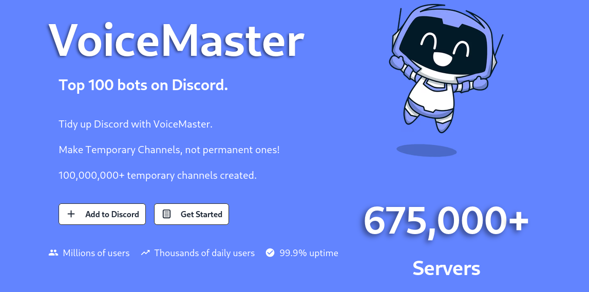
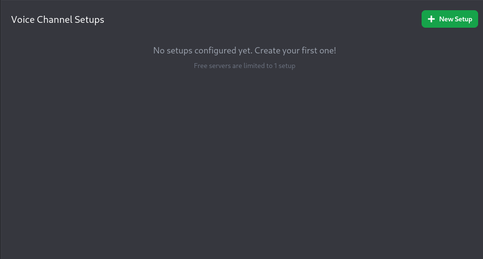

## Voice channel? Nah, let's put any channel in there.
*Fixed on: 22/07/2026*

[Website](https://voicemaster.xyz) | [Discord](https://discord.gg/y9pgpbt)

VoiceMaster is a bot mainly made for managing voice channel things; It allows you to create channels (setups) on which users can join and create their own voice channel. So you don't have to create 312349274982134 private voice channels if your server is big.



On the dashboard, you can create setups and modify them:



When you edit one, this is sent via `PUT` to `/api/dashboard/server-setup?guildId=[guild_id]&setupId=[setup_id]`

```jsonc
{
    "settings":{
        "setup_type":"Enum<default|dynamic|...>",
        "setup_channel_name":"<String>",
        "setup_region":"<ChannelRegion>",
        "setup_bitrate":"<Number>"
        // ... [snip]
    }
}
```

On the request body does not seems to be something that we can play with, but let's look at the query parameters; the `setupId` is actually just the voice channel ID on which you can join to create your channel... What if I put a random number?

If I put a random number, the server now says:

```json
{
    "success":true,
    "setupId":"<Random number>"
}
```

That's weird, but looking at the list of setups, there is going to be nothing actually... strange. But If I put a channel ID from my current guild, indepedently if it's a text or voice channel, it will appear a new panel with the values provided in the body and the `setupId` as the target channel.

The thing that took my eyes is that, there's the endpoint for deleting a panel which is `DELETE /api/dashboard/server-setup?guildId=[guild_id]&setupId=[setup_id]`. As I said, the `setup_id` is just the channel id where the user joins to create a new vc. What this endpoint does is deleting the setup *and the channel on Discord*. So, maybe if I somehow manage to put an arbitrary channel ID under that field, I will get the ability to delete any channel on which VoiceMaster has permissions.

The thing is, as I said; the setup will only appear if the provided channel ID exists in my guild, but, what if the setup is actually created but just hidden because it has an ID with an invalid value? or if it only exists during a short span of time? So I tested to create a setup with a target channel on other guild and delete it quickly... and it worked:

https://github.com/user-attachments/assets/b607296c-95bc-42d0-82a5-4f5e831c273d

Pretty fun thing. As this bot needs the manage channels permission by design, there will be a high percentage of server on which you can delete any channel. 

The dev took a while to fix it.