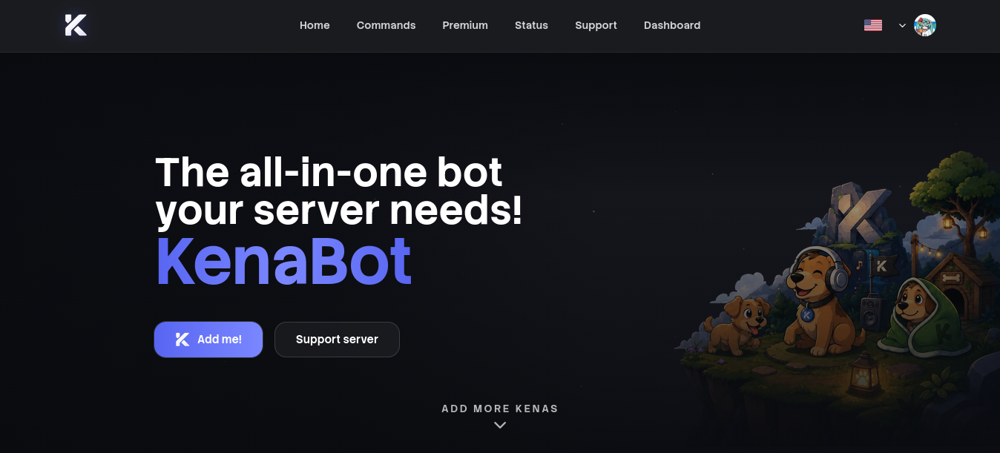
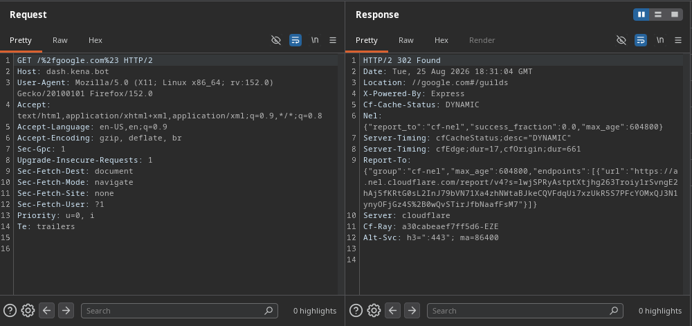

## Decode everything!
*Fixed on: 25/08/2026*

[Website](https://kena.bot) | [Discord](https://discord.gg/kenabot-910907192989843548)

This is a music bot (on its way to becoming multi-purpose) that is widely used across Hispanic Discord communities. One of the featured users of this bot is the [Gatitos World 2](https://discord.gg/gatitos2) server.

I was inspecting the dashboard behavior, and then I saw that if you go to any route without a lang in the first path segment the site would append the respective lang to it. i.e `https://dash.kena.bot/guilds` issues a `302 Found` to `https://dash.kena.bot/en/guilds`, but if you go to an non-existent route like `https://dash.kena.bot/asdasd`, the site would redirect you to `https://dash.kena.bot/asdasd/guilds`, like if it was treating the first path segment as the lang.

Then I also noticed that url encoded characters were getting added to the `Location` header decoded (`https://dash.kena.bot/%23%3f2fxd` sets the `Location` header as `/#?/xd`). As it was starting with a slash, I just appended a `%2f` to make a protocol relative redirect and a `%23` to the end to strip the `/guilds` path segment.

The login endpoint has good protections against open redirects by just allowing this origin and `https://kena.bot` as redirect targets, but with this that is trivially bypassed. I also tried to convert it to a CRLF injection but it wasn't possible.

The devs fixed it quickly.