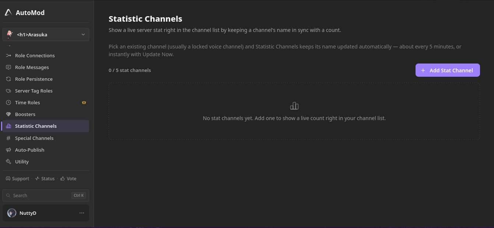

## Edit your channels or any object?
*Fixed on: 27/07/2026*

[Website](https://www.automod.xyz) | [Discord](https://www.automod.xyz/server)

This bot is more focused on moderation stuff as his name may indicate, but on overall, is just another all-in-one Discord bot.


> I discovered this bug before the dashboard was recoded into what you may see now. The listed endpoint does not exist anymore

There is a module that let's you create channels that shows server stats:



Before; when you created one, this was sent to `PATCH /api/v1/discord/channels?guildId=<guild id>&channelId=<channel id>`

```json
{
    "name":"Members: {count}"
}
```

This is sent because the dashboard was modifying the channel before setting it for stats. To modify channels, you send a request to this Discord endpoint (if it wasn't obvious):


> **Modify channel**
>
> `PATCH /channels/{channel.id}`
>
> Update a channel’s settings. Returns a channel on success, and a 400 BAD REQUEST on invalid parameters.

Adding additional fields to modify things like the channel topic was working. And so traversing the path to redirect the request to the Modify Guild endpoint (`/guilds/{guild.id}`):

https://github.com/user-attachments/assets/2683dd04-cfa8-443a-a5ef-af8d36b07c4f

So you can send a `PATCH` as the bot with an arbitrary body, to an arbitrary endpoint. Truly dangerous.

The dev fixed it quickly.