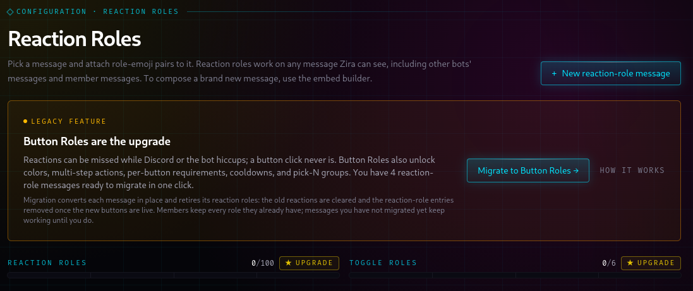

## I'll make your server innacessible
*Fixed on: 14/08/2026*

[Website](https://zira.bot) | [Discord](https://hep.gg/discord)

Zira is one of the oldest well known Discord bots across the platform, despite it being on only ~2M servers. It was (and is) widely used for role management things like reaction roles.


At this date, their dashboard was recently opened to the public. So I decided to look at it. They have the reaction roles function available as legacy, because buttons role selection is substituting them.



When you delete one, a request is sent to `POST /api/dashboard/[guild_id]/reaction-roles/batch` to invoke the `delete_role` intent. The body of that is:

```json
{
    "channelID":"<Snowflake>",
    "messageID":"<Snowflake>",
    "roleID":"<Snowflake>",
    "emoji":"<String>"
}
```

Welp, the `emoji` wasn't validated. But the Discord API wrapper was URL encoding the characters:

```json
{
    "message":"Delete reaction: 405 Method not allowed on DELETE /api/v10/..[snip]/reactions/%2e%2fxd%2f@me%23"
}
```

By the error message, I realized that the bot was using the [Eris](https://github.com/abalabahaha/eris) library. I noticed something a long time ago in the code of it:

```js
if (reaction === decodeURI(reaction)) {
    reaction = encodeURIComponent(reaction);
}
```

For some reason, it only encodes the emoji if there isn't something already URL encoded on it. So putting a string like `./xd/@me#%E2%9D%A4%EF%B8%8F` will make it to not encode anything, but as this is using the native node HTTP module, it will not follow redirects:


```json
{
    "message":"Delete reaction: 302 Found on /api/v10/..[snip]/reactions/./xd/@me#%E2%9D%A4%EF%B8%8F"
}
```

Then I saw that if you go to the root of the Discord web server, a `302 Found` would not be issued and the request will go against `https://discord.com/` exactly. This made me think that there could be some old API versions endpoints that won't throw a redirect if you request them using path traversal. The `/api/v9/invites/{invite.code}` was one of those.

https://github.com/user-attachments/assets/54c0abb3-51c4-4b7b-a8c7-a13f16987bb2

Not very useful as it can only cause some trolling by deleting invites, as you may see.

The dev fixed it quickly.


