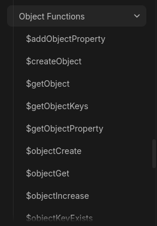

## Finally, something without crashing the server
*Fixed on: 24/08/2026*

[Website](https://ccommandbot.com/) | [Discord](https://ccommandbot.com/join)

This bot is basically BDFD (Bot Designer For Discord) but in bot form. As the name implies, it lets you make custom commands using their own scripting language which is pretty similar to BDFD's one.


There are functions for creating and editing objects:



Testing with deprecated functions (like `$getObjectProperty`) I noticed that the new functions are doing something like this:

```js
if(!obj.hasOwnProperty(prop)) return undefined;

return obj[prop];
```

And the deprecated ones were returning directly `obj[prop]`, because with the following code:

```bash
$objectCreate[{"x":123}]
$getObjectProperty[toString]
```

The bot returned `function toString() { [native code] }`. This is useful for detecting pollutions.

So I saw the `$objectSet` function and when I tried to run it with this:

```bash
$objectSet[__proto__;uwuowo;123]
```

The property was successfully created. Nothing showed up with the new `$objectGet` function, but by using the fact from the `$getObjectProperty` function, I noticed that the property was in there and persisted even on newly created objects without explicitly setting it.

https://github.com/user-attachments/assets/469718c5-3d2b-4974-a4a7-24e13aa54efd

And to sanity check, I tried to retrieve the new property using the same old function on another guild, aand it was in there too.

The dev fixed it quickly.