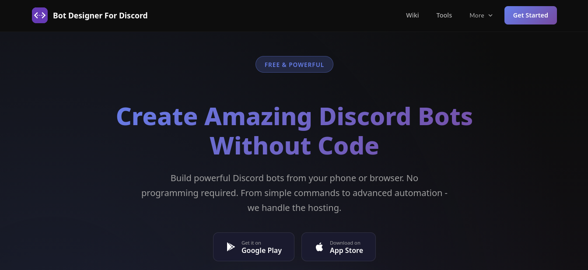
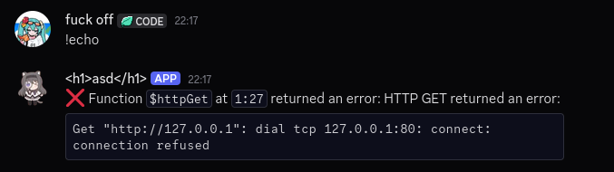
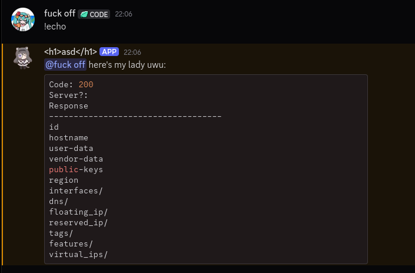
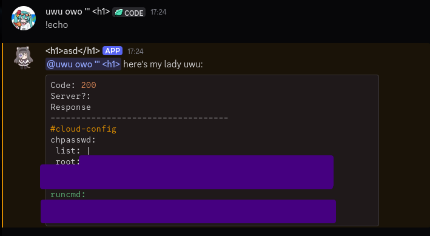

## 69 and 54
*Fixed on: 20/07/2026*

[Website](https://botdesignerdiscord.com) | [Discord](https://botdesignerdiscord.com/discord)

BDFD (**B**ot **D**esginer **F**or **D**iscord) is a web and mobile app that you can use to easily create simple Discord bots using their own scripting language called BDScript.



They provide [some functions for HTTP requests](https://wiki.botdesignerdiscord.com/guides/general/httpRequests.html). It allows sending requests with every HTTP method... good target to look at.

So I tried sending a `GET` to `http://127.0.0.1` with `$httpGet[http://127.0.0.1]`... and it worked (?



I confirmed it by sending a request to the port 22 and seeing that part of the SSH banner was reported as an invalid identifier. But there were no interesting ports to look at, even the Docker network was pretty empty.

But I decided to send the request to my server and inspect it... looking at the ISP of the request ip addresss made something come into my mind:

```bash
[*] Ip: ***.***.***.***
[*] City: Frankfurt am Main
[*] Region: Hesse
[*] Country: DE
[*] Loc: 50.1155,8.6842
[*] Org: AS14061 DigitalOcean, LLC
[*] Postal: 60306
[*] Timezone: Europe/Berlin
[*] Readme: https://ipinfo.io/missingauth
Successfully fetched information.
```

DigitalOcean is a cloud service provider much like Amazon Web Services (AWS), and it has his own internal [metadata API](https://docs.digitalocean.com/reference/api/metadata/) at `http://169.254.169.254`. Clearly, nothing stopped me from requesting data from it:



There was a funny thing at `user-data`:



> If this was the correct one, the SSH password login was disabled anyways. At least.

I also got the internal subnet address, and it gave me the ability to send arbitrary HTTP requests to other nodes and servers in the same network.

The dev took a while to fix it.
